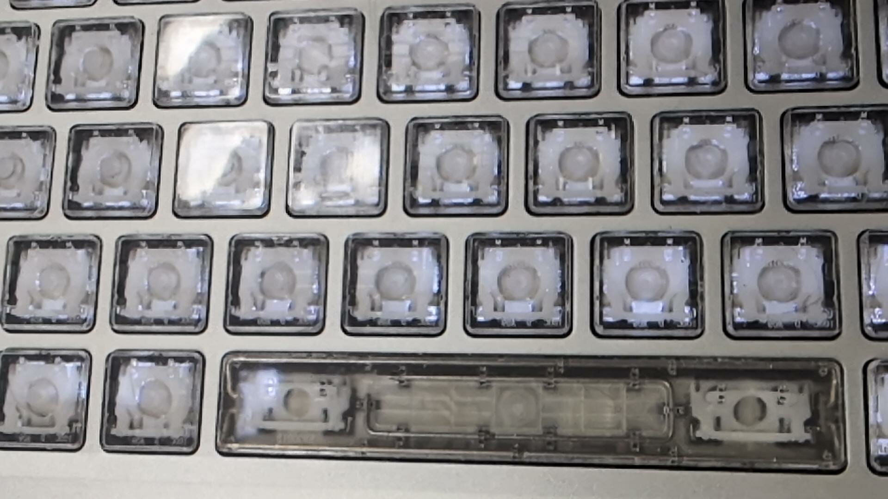

+++
title = "FrameWork 13 : deux ans plus tard"
date = 2025-09-09
draft = false
[taxonomies]
tags = ["computer", "hardware", "linux"]
[extra]
toc = false
display_published = true 
author = "Cætera"
+++

Mon dernier ordinateur, c’est toujours « le meilleur que j’ai jamais eu ! ». Pourtant, avec mon [Framework](framework), c’est un peu différent.  
Il y a près de deux ans, j’achetais un Framework 13, un ultraportable (relativement léger, ≈ 1,2 kg), **modulaire** et _Linux Friendly_.  
Mon ordinateur, c’est bien plus qu’un outil de travail ou de jeu : c’est une machine qui m’accompagne partout, ou presque. Que ce soit à mon bureau, avec son dock USB4, sur le canapé ou en déplacement, il doit donc supporter un train de vie pas toujours tranquille.

  

En octobre 2023, je craquais donc pour le Framework 13 (AMD 7040), qui n’était alors proposé qu’en pré-commande (batch 9), pour la modique somme de 1 049 €, via l’édition « DIY ».  Pour un peu de fun, j’ai opté pour les bords d’écran orange, et pour un clavier « clear » comprendre transparent, sans marquage —en géométrie ISO bien sûr pour profiter de la frappe en _[variante A](https://ergol.org/installation/#variante-en-a-angle-mod)_. 
J’avais un SSD sous la main et j’ai complété avec 32 Gio de RAM pour ~130 € chez Crucial. Je pensais être _très_ large avec de telles specs, mais force est de constater que c’est parfois à peine suffisant pour mon usage : le disque est plein, et je me suis vite retrouvé limité par la taille des modèles IA open-source que j’ai pu tester.  

Cela fait donc bientôt deux ans que je me promène avec la bête et, si je ne suis pas prêt de changer de machine, il me paraît intéressant de faire un retour sur une marque encore relativement récente dans le monde du PC portable. Et surtout de répondre à la fameuse question : suis-je satisfait ?  Si je devais racheter un ordinateur, craquerais-je à nouveau pour un Framework ?  

Pour y répondre, il faut que je parle un peu de mon usage, qui n’est pas forcément le vôtre. Je ne suis pas développeur. Je suis simplement un enthousiaste un peu touche-à-tout qui traîne sur les internets depuis sûrement trop longtemps.  
En résumé : beaucoup de navigateur, un peu de code, quelques expérimentations avec des modèles IA locaux, que ce soit des LLMs ou de la reconnaissance d’image. Occasionnellement, je fais un peu de modélisation 3D et de la retouche d’image, mais rien de très gourmand.  
J’ai utilisé cette machine pendant un an et demi au travail, et depuis, uniquement à titre personnel.  

.  

Côté robustesse, la machine a fait ses preuves : mon enfant (~13 kg) marche régulièrement dessus malgré mes remontrances et mes tentatives pour mieux le cacher. Résultat : un très léger renfoncement, quasiment imperceptible, mais la machine fonctionne toujours sans problème.

(regardez bien en haut à gauche)

### Linux
Installation et utilisation quotidiennes sans accroc. Le lecteur d’empreinte est compatible Linux. Je ne pensais pas m’en servir, mais finalement, dans les premiers jours d’[Ergo‑L](https://ergol.org/), quand la disposition n’était pas encore intégrée à XKB, ça m’a été pratique. Il est capricieux, mais une fois le bon geste trouvé, ça fonctionne.  

### Modulaire et bien pensé
Les cartes d’extension (USB-C, USB-A, HDMI…) font exactement ce qu’on attend d’elles. Et pouvoir recharger l’ordinateur des deux côtés est un confort dont on ne veut plus se passer.  

Je pensais que les ports interchangeables seraient un gadget, mais au final, c’est très pratique de pouvoir ajouter une prise HDMI juste avant une conférence. C’est aussi utile de pouvoir remplacer un port endommagé à force de brancher/débrancher des câbles de qualité variable.  

### Clavier / trackpad plaisants
Le clavier est très agréable. Comme je tape beaucoup (Vim, terminal, Vimium…), ça compte. Le trackpad est aussi de bonne facture, ce qui n’est pas si courant.

### Respect de la vie privée
Les interrupteurs matériels pour la caméra et le micro sont un vrai plus. Un clic, et c’est coupé : pas de doute possible.  

### Rapport puissance / prix intéressant
Pour les machines d’entrée de gamme, le rapport puissance / prix est discutable. Mais sur une configuration comme la mienne — 32 Gio de RAM, 1 To de SSD, processeur récent —, on est plutôt compétitif.  

Ce que j’aime moins
---
### Autonomie : trop courte dans mon usage
En usage classique, et en limitant la charge à 75 % pour préserver la batterie, je tourne autour de 4 h 30. C’est plus que ce que j’ai eu auparavant, donc pas rédhibitoire, mais ça reste juste. Ce n’est même pas une demi-journée d’utilisation.  
Autant dire qu’il faut toujours avoir une prise pas trop loin. On est bien loin de l’efficacité des Mac, et même d’autres machines qui promettent (sur le papier) 8 h d’autonomie.  
C’est _le gros_ inconvénient de cette machine pour moi.  

### Audio moyen
Les haut-parleurs sont corrects, sans plus. Suffisants pour une visio ou une vidéo, mais pas pour écouter de la musique ou regarder un film confortablement.  

### Connexion Wi-Fi capricieuse
Je ne sais pas si c’est lié à la puce MediaTek (qui a mauvaise réputation), à un problème de pilotes ou autre, mais j’ai eu des coupures intempestives de réseau lors de visioconférences.  
Était-ce l’infrastructure, l’ordinateur, les deux ? Je n’ai pas creusé, et en dehors de ce cas d’usage précis, pas de souci.  

### Le clavier “clear”
C’est **joli**, ça attire l’œil… jusqu’à ce que ça devienne un peu glissant après une utilisation continue. La microfibre et l’alcool ménager deviennent alors indispensables.  
Autre bémol : si on regarde de près, on distingue les petites saletés accumulées sous les touches. Rien de dramatique, mais jamais agréable.  

De plus, avec mon usage intensif, la touche **AltGr** s’est fendue. Ce n’est pas gênant pour taper, mais je ne sais pas comment ça va évoluer. La bonne nouvelle, c’est que, moyennant quelques euros, je peux toujours remplacer le clavier.  

👉 Le clavier “clear”, c’est cool, mais je ne suis pas certain de retenter l’expérience.  

Verdict
---

Le Framework 13 (AMD 7040) est une machine attachante. Pas parfaite, mais la cause qu’elle défend me donne envie de lui laisser sa chance.  
Les mauvaises langues diront qu’on s’enferme dans un énième écosystème propriétaire, mais le fait d’avoir ouvert les modules en open-hardware va dans la bonne direction.  

La machine pose peut-être les bases de ce que pourrait être une électronique moderne : plus modulaire, plus réparable. En tout cas, c’est une machine très bien exécutée et, si vous pouvez passer outre ses petits défauts (batterie…), c’est une très bonne option.  

Quand ma femme aura besoin d’un ordinateur, je sais déjà ce que je lui proposerai. Quant à moi, je suis déjà équipé, et prêt à upgrader vers une version RISK-V quand la techno aura murie.  

