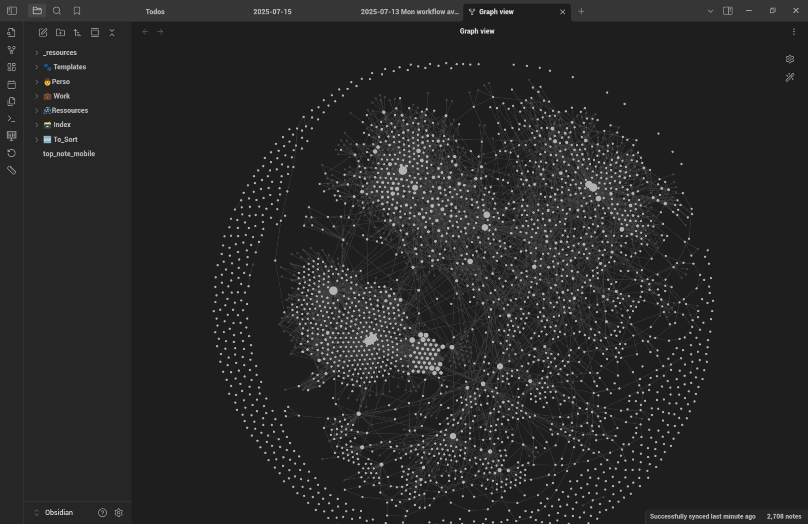

+++
title = "Organiser sa vie avec Markdown"
date = 2025-07-13
draft = false
[taxonomies]
tags = ["Productivité", "Obsidian"]
[extra]
toc = false
display_published = true 
author = "Cætera"
+++


Je n’aimais pas écrire. Je n’ai jamais aimé ça —probablement parce que je suis globalement mauvais en communication et que je n’ai jamais compris comment ça fonctionne.
Petit, j’avais une très bonne mémoire, et j’étais très lent pour écrire. J’avais donc pris l’habitude de ne noter que le strict nécessaire pour mes cours avec un système hiéroglyphique que seul moi pouvais comprendre.
Plus tard, dans ma vie professionnelle, c’était pareil : très peu d’écrit —le strict minimum. La trentaine approchant, je me suis rendu compte que ma mémoire n’était plus aussi bonne et que je me posais de nouvelles questions :

> *« Que s’est-on dit déjà dans la dernière réunion ? »*
>
> *« Mince, qu’est-ce que le client m’avait dit, déjà ? »*

Ça devenait de plus en plus critique, et j’ai donc commencé à prendre des notes. J’utilisais [Joplin](https://joplinapp.org/) à l’époque : libre, compatible avec [Nextcloud](nextcloud.com/), il cochait toutes les cases, philosophiques comme techniques. Je pouvais même avoir mes notes sur mon téléphone.

Petit à petit, un problème apparaissait cependant. J’avais bien vu que je m’éloignais de la gestion par dossier au profit d’une gestion par tag partout où c’était possible. Pourtant, ce *workflow* était compliqué avec Joplin.
Je me suis donc intéressé à [Obsidian](https://obsidian.md/) qui, bien qu’il ne soit pas libre, avait l’avantage d’utiliser uniquement des fichiers markdown dans des dossiers classiques, rendant *a priori* l’ensemble facilement exportable.


En deux ans, je suis passé d’un stade où je n’aimais pas écrire à un stade où je prends des notes **quotidiennement**. Elles m’aident à noter les choses importantes, à me souvenir de tout, et à retrouver l’information le plus fluidement possible.
Mais ça ne s’est pas fait en un jour, et je n’ai pas tout maîtrisé du premier coup. Voici quelques astuces en la matière.

Organisation
---
Mon organisation n’est pas parfaite, elle est le résultat d’un historique avec différents
logiciels, mais aussi la nouvelle approche que j’ai avec Obsidian. Petit à petit tout tend
à s’améliorer, mais reprendre les plus de 2000 notes que j’ai serait bien trop chronophage
pour une utilité réduite.

Voici donc la structure à laquelle je suis arrivée aujourd’hui :

```sh
Obsidian
├── 🆕 To_Sort
├── 🐾 Templates
├── 👨 Perso
├── 💼 Work
├── 🖇️ Ressources
└── 🗃️ Index
```

### To_Sort & Template
Les dossiers les moins intéressants, mais tout de même essentiel. 
- **To_Sort**, C’est le dossier dans lequel les notes sont créées par défaut ; il me permet de voir ce qui n’est pas encore finalisé.
- **Template**, le dossier qui regroupe mes modèles. 

### Perso
C’est le dossier qui a le plus de sous-dossier, bien trop chargé à mon goût, il hérite de mon époque Joplin. On y trouve des check-lists, des notes bibliographiques (citations, réflexions prises en lisant un livre), etc. 

Aujourd’hui, deux sous-dossiers sont vraiment utilisés :
- **Journaux** : C’est là que vont mes notes quotidiennes. Notes personnelles sur ce que je fais,
c’est un bon moyen de de souvenir d’où je suis allé, de quand est-ce que j’ai été malade (et avec quel
traitement), de quand j’ai rencontré telle personne pour la dernière fois. Tout ce qui me semble important est noté dans une note quotidienne. 
- **Pensine** : petite référence à _Harry Potter_, ces notes sont toutes les idées, les notions que j’ai pu avoir spontanément, ou en lisant.
Ce sont des notes qui suivent un peu les principes du [Zettelkasten](https://www.soenkeahrens.de/en/takesmartnotes).
Ces notes sont aussi **atomiques** que possible : elles se concentrent sur _une seule idée_, écrite de la façon la plus succincte possible : la force d’Obsidian, c’est d’être capable de faire des liens entre les notes. Pour que ces liens soient pertinents et compréhensibles, chaque note doit être bien ciblée.
Cette section regroupe ce qu’on pourrait appeler  

### Index
Certaines notes sont des points d’entrés vers d’autres notes, par exemple, j’ai une notes `recettes de cuisine`, qui liste et organise toutes les recettes que je peux avoir, permettant de m’y retrouver facilement. 
D’autres notes sont plus conceptuelles. Je les appelle parfois « _notes covalentes_ » car elles servent de liant entre d’autres notes (atomiques).
Ce peut être des notions comme `logiciel libre`, des personnes `John DOE` ou des chose particulière `Ergo‑L`, et elle me permettent ensuite de faire des recherches efficaces.
Par exemple, à partir de `John DOE`, je peux retrouver les réunions, événements, auxquels on a participé ensemble, où encore la liste des entreprise pour lesquelles il a travaillé, etc.
Pour quelque-chose comme Ergo‑L, ça me permet de cible les moment dans l’année sur lesquelles je me suis concentré sur le sujet et de retrouver les jalons du projets. 

Bref, ce sont des notes qui permettent de faire de l’archéologie.

### Ressources
les rares pièces jointes accompagnant mes notes. J’essaie, autant que faire se peut, de rester sur du texte pur.
Mais, de temps en temps, des images viennent se greffer…
J’ai essayé plusieurs méthodes de classement pour ces _ressources_ : sous-dossiers, dossier unique, sans résultat concluant. Pour l’instant, un dossier centralisé fait l’affaire, il permet de réutiliser facilement une même ressource, mais s’éloigne du standard markdown et donc la compatibilité avec d’autres logiciels si jamais je viens à changer…

Création d’une nouvelle note
---
Au début, habitude hérité d’à peu près tous les logiciels que j’ai créé, je faisais un <kbd>Ctrl</kbd>+<kbd>n</kbd> pour créer une nouvelle note.
Ce n’est pas idéal, parcequ’on se retrouve souvent avec des notes orphelines, des notes qui ne sont liée à aucune autre, et qui sont donc plus difficile à retrouver et à “exploiter”.
Une méthode qui me convient mieux et de toujours créer une notes depuis un autre notes en allant sur cette note et en tapant `[[Nouveau nom]]`.
Cette méthode fait que par défaut, on a _au moins_ une note liée à notre nouvelle note —souvent la note journal quotidienne. 
Ça permet au moins de capturer de contexte de la création ; et, cerise sur le gateau, avec cette méthode, il est possible d’utiliser des raccourcis clavier pour mettre un _timestamp_ dans une note par exemple, (<kbd>Alt</kbd>+<kbd>d</kbd> pour la date, format ISO, dans mon cas), ce que je fais systématiquement pour des réunion (`timestamp nomEtreprise nomContact` ce qui permet de retrouver la note facilement à partir de la date, du contact principal ou de l’entreprise)

Navigation
---

En passant d’un système hiérarchique (Joplin) à un système plus fluide, avec beaucoup, _beaucoup_ de notes dans un dossier, on pourrait croire que la navigation devient plus complexe.
J’avais un peu peur de ne pas m’y retrouver au début…
Mais enfait, c’est souvent **plus simple**.
Dans la majorité des cas, je connais (presque) le nom de la note que je veux ouvrir. Il me suffit donc d’un <kbd>Ctrl</kbd>+<kbd>O</kbd> et de commencer à taper pour que les notes pertinentes soient proposées. 
Parfois, c’est moins direct. Je me demande, par exemple :

> *Comment s’appelle le contact principale chez XYZ déjà ?*

J’ouvre alors la note `XYZ`, qui contient une section :

```md
Contacts Affiliés
-----------------
```dataview
LIST
FROM [[]] AND "🗃️ Index/Personnes"
```  
```

ce qui donne :
```md
Contacts Affiliés
-----------------
- John DOE
- John DOEUX
- John Trois
```

Soit une liste de toutes les personnes liées à l’entreprise, listées par ordre alphabétique.
Je n’ai plus qu’à suivre le lien… Facile !

De même, parfois, je ne sais plus exactement ce que je cherche (une citation dans un livre, une recette dont le nom m’échappe…). Je cherche alors le nom de la note-index associée (le livre ou la liste de recettes), et je retrouve facilement ce que je cherchais.

C’est redoutablement efficace, à condition d’avoir des notes-index comme repères thématiques dès qu’on commence à accumuler un peu de contenu sur le thème en question.

Finalement, je ne suis **pas du tout gêné** d’avoir « trop de notes dans un dossier ».
Le fait de ne plus avoir une structure, à penser, à maintenir me fait gagner du temps : pas besoin de me demander _où_ une note devrait aller, et changer ma façon de classier de temps en temps.
C’est cohérent dès le départ et ça le reste.
 
{{gif(path="chefs-kiss-french-chef.mp4")}}

Méta-organisation
---

À l’époque Joplin, j’utilisais les *tags* pour relier des notes autour d’une thématique.
En réalité, je ne m’en servais pas beaucoup, mais ça me semblait la « bonne pratique ».
En passant sur Obsidian, je me suis peu à peu rendu compte que créer des notes dédiées était plus puissant.
Non seulement l’interface y pousse, mais c’est aussi bien plus *flexible*.

Par exemple, remplacer le tag `#première_fois_fiston` par une note `première fois fiston` me permet ensuite d’utiliser *dataview* pour lister toutes les notes (quotidiennes ou autres) où cette notion apparaît —par ordre chronologique.

J’ai donc complètement arrêté d’utiliser les tags… jusqu’à ce que je leur trouve *une autre utilité* : *l’automatisation*.

J’en avais assez de devoir insérer manuellement certains modèles, comme les vues `contact affilié` pour une entreprise. J’ai donc écrit un petit script Python pour ajouter ces éléments automatiquement.
Très vite, ce script s’est enrichi : aujourd’hui, il ajoute automatiquement les données `vCard` de mes contacts Nextcloud dans les notes de contacts.

Naturellement, quand je travaille sur ces scripts, je veux souvent cibler un **type** de note : réunions, personnes, notes quotidiennes, etc.
J’avais pensé utiliser les dossiers, mais ce n’était pas assez précis : mon dosser de notes quotidienne par exemple regroupe _principalement_ ces notes, mais aussi des points ponctuels notés à part pour être relié à autre chose et réutilisé sans avoir à lire toute la note du jour.
Et c’est pareil pour chaque dossier, on y trouve toujours au moins une note qui n’a pas meilleur endroit où aller mais qui n’est pas exactement du même type que les autres. 

C’est là que les _tags_ se sont de nouveaux manifestés et imposés comme solution : pour **spécifier le(s) type(s)** de la note.
Dans ce cas, les tags _dans les métadonnées_ (YAML frontmatter) sont plus adaptés que les tags _inline_, car ils décrivent la nature de la note elle-même, pas son contenu.


Conclusion
---
Depuis que j’utilise Obsidian pour tout, avec l’intégration des _vim-motions_, prendre des notes est devenu un plaisir.
Je *veux* que mon système soit cohérent, que mes notes soient bien liées entre elles, car cela renforce leur utilité et leur accessibilité.

Je me suis aussi rendu compte qu’écrire mes pensées — ce que le moi d’il y a dix ans aurait jugé chronophage et inutile — m’aide à mieux structurer ma réflexion.
Combien de fois ai-je évité des erreurs ou du travail superflu en me posant les bonnes questions ? Beaucoup. Et de plus en plus.
Ces questions ne sont apparues que grâce à l’écriture… et à la relecture, à la réécriture.

Je ne peux donc que vous conseiller une chose :
écrivez plus —et si Obsidian vous permet d’en tirer du plaisir, ne vous en privez pas.


