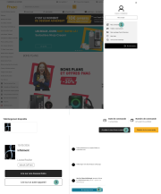

+++
title = "Reprendre le contrôle de ses livres numériques sous Linux"
date = 2026-04-29
draft = false
[taxonomies]
tags = ["lecture", "FOSS", "tuto", "epub", "DRM"]
[extra]
toc = false
display_published = true 
author = "Cætera"
comment_id = "116489975383452430"
+++

Lire pour dormir
----------------

Lire est une habitude. Petit, je n’aimais pas ça ; c’était long et pénible pour arriver à suivre et à arriver au bout, surtout comparé à un film. Maintenant c’est un besoin, lire fait partie de mon long process pour arriver à fermer l’œil à une heure raisonnable. 
Fini les nuits trop ~~courte~~ longues, et le cerveau saturé en permanence. —lire m’a permis de me réapproprier mon cerveau. 

Mais trouver un bon livre, un qui vous pousse à ouvrir la 1ᵉ de couverture tous les soirs, ce n’est pas facile. Petit à petit, grâces aux bibliothèques municipales, j’ai appris à apprécier différents genres, fantastique, science-fiction, classique, philosophie. Voyager avec toujours un livre d’avance c’est encore plus compliqué. Et c’était un de mes problèmes il y a une dizaine d’années. À l’époque, je voyageais beaucoup pour le travail. Souvent loin. 
J’emportais alors mes livres qui me permettaient, quand c’était nécessaire, de lutter contre le décalage horaire. 

Plus que pratique, c’était essentiel. Le problème, c’est que je lis plusieurs livres en même temps et que j’ai _besoin_ d’en avoir toujours un d’avance pour ne pas me retrouver le bec dans l’eau en cours de route. 

Le poids des livres
------------------

Entendant cela, mon grand-père me donne une liseuse –une kobo aura— qu’il avait eu et qui, après avoir essayé une semaine, avait fini par la poser dans un tiroire. 
J’étais peu convaincu, étant habitué à l’odeur d’un livre ayant vécu, au grain des pages des éditions XO, à la finesse des papiers bibles de la Pléïade. 

Au début, je ne m’en servais que pour mes voyages ; j’avais donc systématiquement une copie physique de mon livre et n’avais _aucun scrupule_ à aller chercher une copie numérique de mon livre partagé gratuitement sur internet.

Puis, j’ai appris à apprécier la liseuse. Beaucoup. 

C’était non seulement pratique de voyager léger, mais c’est également une lecture un peu différente. Je lis souvent en VO, il est facile de lire dans d’autres langues et de regarder la signification d’un mot grâce aux dictionnaires installés. C’est aussi simple de prendre une note pour revenir sur un passage plus tard —notamment une fois le livre terminé— que ce soit pour relire un passage marquant ou pour prendre une note pour mon [deuxième cerveau][obsidian]. 

J’ai continué mon expérimentation avec la liseuse avec les classiques. Ils avaient l’avantage d’être dans le domaine public et donc d’être facilement trouvable légalement. 
J’achetais toujours les autres livres en physique. Et puis, à force, j’ai commencé à me dire que c’était dommage de participer à l’élagage des arbres alors que j’avais _déjà_ une liseuse qui ne demandait qu’à servir davantage… C’est là que les problèmes ont commencé. 

Lire un livre sur un OS libre
-----------------------------
Télécharger des livres que j’avais achetés ne me posait aucun problème moral. Le faire sur des livres où je n’avais pas participé à la rémunération des artistes (oui, il y a aussi, les dessinateurs pour les couvertures), c’était une ligne que je n’étais pas prêt à franchir. Pour continuer à avoir des livres de qualité, il faut participer —à son échelle– à l’industrie.

C’est là que j’ai fait la connaissance des DRMs, gestion des droits numériques en bon français. Un mot galvaudé pour dire verrou numérique.
Le problème est simple. Un fichier sur un ordinateur, ça se copie facilement. Les éditeurs ne veulent donc pas mettre les livres numériques (au format epub) directement au téléchargement après achat, car il est possible de les partager (trop) facilement.
Ils ont donc inventé une technologie pour recréer artificiellement de la rareté dans nos ordinateurs : les DRMs. 

Certains éditeurs font les choses bien et choisissent de proposer des livres sans DRMs directement sur leur site comme [la maison « Critic »][editeur], ce qui m’a permis  d’acheter _Grain de Sable_ de Louise Roullier (_aka._ [Histoires Mythiques][hist-myth] sur Masto), mais ce n’est clairement pas la majorité.

Le paradoxe, c’est que les DRM ne compliquent pas la vie de ceux qui piratent. Ils compliquent surtout celle de ceux qui paient.

Refusant d’aller sur Amazon, la [Fnac] semble être la source la plus complète, après l’achat en direct chez l’éditeur pour trouver notre bonheur. 

Pourtant, lorsqu’on achète un livre sur la Fnac, on se retrouve avec un fichier `URLLink.acsm` en lieu et place d’un fichier `*.epub`.
Ce fichier est en fait une sorte de lien pour télécharger l’epub acheté, et fonctionne théoriquement avec le logiciel _Adobe Digital Edition_ qui ne fonctionne… pas sous Linux. 

C’est pénible.

J’abandonne un temps (téléchargeant les livres sur d’autres sites, après les avoir payés), mais tout n’est pas disponible sur internet. 
Surtout ce qui vient de sortir.

Il va falloir trouver comment récupérer ces livres légalement sous Linux.

Contourner les DRM de ses livres achetés
----------------------------------------

  

  1. Récupérer l’epub sur le site de la Fnac.
  Ce n’est pas si simple, voici la procédure…

  

2. Installer le logiciel libre Calibre dont les plugins serviront à récupérer et casser les DRM sur nos livres _achetés_

  

  3. Installer les plugins [DeACSM] et [DeDRM], nécessaires pour récupérer le fichier _avec_ DRM avant de les faire sauter. 

  

Pour installer un plugin calibre suivre cette procédure :
{{gif(path="installer_un_plugin_calibre.mp4")}}

4. Lier DeACSM à notre compte Adobe Digital Edition (créer un compte pour l’occasion, c’est plus _safe_)
5. Et voilà ! à l’ajout d’un livre (faire glisser le fichier `.acsm` dans calibre), l’epub est automatiquement récupéré, le DRM cassé et disponible dans notre bibliothèque.

> [!NOTE]
> Lors de mon premier essai, le plugin DeACSM ne fonctionnait pas avec le fichier `URLLink.acsm` récupéré sur la Fnac. Je ne sais pas pourquoi. J’ai dû re-télécharger le fichier sur le site de la Fnac pour que ça fonctionne. 

Depuis, je peux acheter mes livres légalement, et en profiter derrière sur ma liseuse qui n’est pas relié à un compte Fnac ou autre.
Je peux donc vraiment profiter de ce que j’ai acheté, librement, sur le matériel que j’ai choisi. 

La prochaine étape serait de se passer des services de la Fnacs et être capable de récupérer les livres directement sur mon serveur Nextcloud / Calibre. 
Mais là je n’ai plus l’énergie, je vais lire un peu avant d’aller me coucher. 

[hist-myth]: https://diaspodon.fr/@hist_myth@mastodon.top
[DeACSM]: https://github.com/Leseratte10/acsm-calibre-plugin
[DeDRM]: https://github.com/noDRM/DeDRM_tools
[editeur]: https://editions.critic.fr/
[obsidian]: @/blog/organiser-sa-vie-avec-md/index.md
