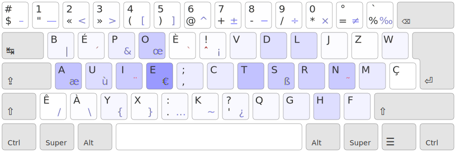
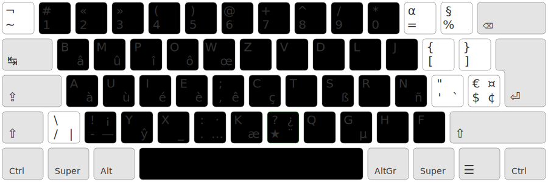

+++
title = "Voyage Ergonomique : À deux touche du confort"
date = 2026-02-28
draft = false
[taxonomies]
tags = ["clavier", "linux"]
[extra]
toc = false
display_published = true 
author = "Cætera"
+++

Après avoir [découvert la dactylographie et ses concéssisons](/@/blog/voyage-ergonomique-1), je me demaidai si la disposition parfaite _pour mon usage_ existait.

J’avais notamment été refroidi par mon apprentissage laborieux de [Bépo] tout ça pour me rendre compte quelques semaines plus tard que c’était vriament inadapté à la frappe en anglais.

Lors de mes recherches sur les alternative, je tombe alors sur [Ergo‑L], un projet —personnel inachevé— mais prometteur. Son objectif ? Être _ma disposition_ ; soit être confortable en Français, en Anglais, et pour faire du code —avec vim nottamment.

Pour y parvenir, ils avaient mis au point une méthode redoutable :
- les touches les plus accessibles contiennent les lettres _sans diaciritiques_ ;
- Les diacritiques sont fait à l’aide d’une touche unique ★™ sur laquelles je reviendrais ;
- la touche Alt est utiliée pour acceder facilement aux symboles de programmation, qui sont organisés pour faciliter la vie avec Vim. 

En somme le paradigme est très différent, contrairement à Bépo, qui va chercher à avoir toutes les touches nécessaire sur le clavier, quitte à les positionner _~~très~~ trop_ loin —c’est la seule disposition à ma connaissance utilisant 7 colonnes sur la main droite— on fait venir les touches sous les doigts. 

Ça me semble être une approche moderne de la dactylographie, où les contraintes des machines à écrire ne sont plus retenue, où on fait table rase du passé pour imaginer de nouvelles solutions simples et élégante. 

La touche typographique <kbd>★</kbd>
---
La touche typo(graphique) est une touche magique. Les touches « mortes » classique comme l’accent circonflexe `^` sur le clavier ne fait rien au premier appuis mais applique ensuite un accent circonflexe sur la touche touché après. La touche typo <code style="font-size:2em;">★</code>, c’est le même principe, mais en plus _magique_ —  elle ne se cantonne pas à une seule action. Elle est utilisée pour tous les caractères nécessaire à la frappe du français. Elle donne accès à tous les diacritiques (accents, grave, aigüe, circonflexes, cédilles), mais aussi les ligatures (`œ æ`) ainsi que les tirets (demi)cadratins cher à ChatGPT. 

Venant de qwerty-int, faire parfois deux touches ne me dérange pas, surtout quand la touche « typo » est bien positionnée. Comme le dit un ergonaute, avec la touche typo, on a deux fois plus de caractères sur la ligne de repos et ça c’est trop bien. 

Le problème, c’est qu’à l’époque (maintenant révolue), Ergo‑L n’est pas stable. La disposition est en plein développement et connaitra encore quelques changements importants. Je ne me vois pas passer sur quelque-chose qui n’est pas stable, j’ai quand même besoin de travailler sur mon ordinateur. 

Par contre, le groupe derrière Ergo‑L, concient des compromis à mettre en œuvre et de la comprexité à faire une disposition clavier développe plusieurs outils :
- Un analyseur qui permet de repérer rapidement les défauts d’une disposition clavier ;
- Un générateur de pilote _cross platform_ : [Kalamine] ;
- un composant web permettant d’apprendre une disposition générée par Kalamine [ducktypist]. 
Il n’en fallait pas moins pour me motiver à entrer en contact avec les développeurs et tenter de faire une solution simple : adapter Bépo que je connait en y ajoutant les principes d’Ergo‑L —c’est ainsi que naquis [Bépolar].

Bépolar
-------
Adapter une disposition, c’est quelque-chose de bien plus simple que de partir de zéro comme le faisait [Nuclear Squid][nuke] avec Ergo‑L. 
Mes contraintes étaient claire :
- rester le plus proche de bépo ;
- mettre les chiffres en accès directs parceque je préfère ;
- enlever les touches avec diacritique comme `É È` pour _rapprocher_ les touches trop exentrée ;
- positionner les touches avec diacritique de sorte de diminuer les enchainements de touches inconfortables : bigramme de même doigt, ciseaux, &t. 
- utiliser la « couche » comprendre la disposition des symboles accessible via AltGr pour la programmation développée pour Ergo‑L et qui commençait à se stabiliser. 

Le tout en étant le meilleur possible en Français mais aussi en Anglais. 

En partant de bépo, je récupère donc la position de `É È À Ê` pour caser toutes les touches dans les positions les plus confortables ; celles qui ont des lettres en Qwerty.

Je vous passe ici les détails de conceptions, mais, grâce au support de différents membres de la communauté des ergonautes, j’arrive à la disposition suivante :

C’est pas mal. Je propose d’ailleurs mon approche pour inclure le point d’exclamation dans la disposition en relégant le tréma, peu usité, en double pression sur la touche <code style="font-size:2em;">★</code>. 

Concernant Bépolar, je suis content, malgré une métrique de bigramme à un doigt un peu plus élevée que Bépo en Français, je trouve la disposition aussi agréable, si ce n’est plus. En anglais et pour coder par contre ça n’a rien à voir. L’approche fait ses preuves et rend la disposition _un cran au dessus de bépo_ et même de Qwerty.

Le point fort, c’est que venant de bépo, l’apprantissage se fait très rapidement. J’ai mis deux jours à m’habituer complêtement et à retrouver ma vitesse de bépo. C’est moins d’une semaine pour toutes les personnes que je conaisse qui y sont passé. Ma précision augmente aussi ce qui me permet _in fine_ de taper plus vite. 

Pour eux comme pour moi, c’est un déclique, c’est la confirmation —avec un faible investissement— que la philosophie Ergo‑L fonctionne. Ça me pousse donc à _ne pas_ proposer Bépolar dans linux de base. Je veux inciter tous ceux qui ont l’occasion de passer sous Ergo‑L qui fait mieux car conçus sans la contraite de rester proche de bépo. 

Découverte de la variante A ou _angle mod_
----------
Une fois Ergo‑L finalisé, environ un an plus tard, je tente l’aventure et me lance dans sont apprentissage. J’en profite pour introduire un changement majeur dans mon ergonomie : la variante A. 
J’en  avait entendu parler à plusieur reprise sur le web et sur le discord, mais c’était encore assez flou pour moi. La variente A, ou _angle mod_ en anglais, c’est une façon de rendre la frappe plus confortable. 
Dans un clavier classique, les deux mains ne sont pas symétrique. Elle font un peu un mouvement en `\\` si on suit les préceptes de la dactylographie classique : une colonne par doigt, mais le clavier a des touches décallée.  <kbd>Q A Z</kbd> sont fait avec un doigt l’auriculaire. 
Cette variante, disponible sur les clavier européens propose dede décaler les touches du bas pour que la saisie des touches et notamment de la touche <kbd>B</kbd> en Azerty (qui est trèé loin en dactylo, et peu pratique) soit plus simple. 

Cette variante est un gros gain enrgonomique et je ne me verrais plus tapper sur un clavier sans cette astuce qui change vraiment la vie et permet de se passer de clavier ergonomique dans bien des cas, surtout en déplacement. 
La variante A pose cementand une question, que faire de la touche libérée ? Le fameux <kbd>B</kbd> en Azerty, trop loin pour être utilisée confortablement dans de la frappe en dactyulo, mais suffisament proche pour en faire un usage conrrect dans des cas ponctuels. 

Certains y ont mis la touche supp/backspace. J’ai trouvée une meilleur approche —une autre touche magique. 

L’autre touche magique <kbd>⎄</kbd> 
---
C’est là que la touche compose entre en jeux. Cette touche, c’est une touche standart sous linux, qui peut aussi être utilisé sous d’autres OS via l’installation d’un programme complémentaire, c’est la touche _Compose_ (<kbd>⎄</kbd>).

Sous Linux (et parfois ailleurs avec des astuces), la touche Compose vous permet de créer des caractères à la volée. Une fois configurée, elle transforme des séquences simples en caractères magiques :

- <kbd>⎄</kbd>-`ae` pour `æ` (oui bon c’est inutile en Ergo‑L, `æ` est déjà disponible avec la touche typo).
- <kbd>⎄</kbd>-`->` pour `→`.
- <kbd>⎄</kbd>-`e'` pour `é` (toujours innutile en Ergo-L, mais ça illustre le fonctionnement).
- &c.

Il existe des séquences de base qui vont dépendre de vos paramètres régionaux (ou _locale_), mais il est également possible d’ajouter des séquences personnalisées. Vous trouverez [ici les séquences composes](https://cgit.freedesktop.org/xorg/lib/libX11/plain/nls/en_US.UTF-8/Compose.pre) les plus courantes disponible pour la _locale_ en_EN, dont une bonne partie sont reprises en français. 
Pour les linuxiens, vous pouvez personnaliser ces séquences dans votre fichier `~/.XCompose` pour les adapter à vos besoins.

> **NB :** Ne pas oublier de recharger sa méthode de saisie (ex. sous Gnome `ibus restart`) **ou** de se relogger pour que les changements soient appliqués
> 
> **Pro-tip :** On peut, pour se simplifier la vie, en ajoutant des préfixes pour les séquences de mêmes types. Par exemple, dans mon fichier compose, tous les émojis commencent par le symbole `:`. Cela permet d’éviter les collisions avec d’autres symboles tout en étant plus simple à mémoriser.
> 
> **Pro-tip2 :** Il est même possible d’avoir un système de _snipets_ en faisant en sorte que <kbd>⎄</kbd>-`rdv` écrive `rendez-vous`, on peut faire de même pour écrire sont adresse courriel ou d’autres information non sensible.

---

L’avantage de la touche compose pour des caractères _peu fréquents_, c'est qu’il est souvent plus facile de mémoriser une séquence de caractère (utilisant des symboles proches comme <kbd>⎄</kbd>-`1dk` (_one dead key_, le nom de la touche typo en anglais) pour <code style="font-size:2em;">★</code>) plutôt qu’une touche définie de façon arbitraire dans un pilote.
C’est votre liste et vous pouvez la remplir de sorte que _vous_ vous en souvenez. 

Conclusion
----------
À traver ce voyage ergonomique, j’ai appris une chose : une disposition est toujours une affaire de compromis.
Le nombre de touches réellement confortables est limité ; au-delà de la ligne de repos, chaque déplacement a un coût.

L’idée d’Ergo-L n’est pas d’ajouter des caractères, mais de les rapprocher :
- Rapprocher les lettres fréquentes dans la couche α.
- Rapprocher les diacritiques dans la couche typographique ★.
- Rapprocher les symboles de code dans la couche AltGr.

Autrement dit : placer les usages fréquents là où les doigts reposent déjà.

Le reste suit naturellement.

Ce qui est moins fréquent ne doit pas encombrer la disposition.
Il doit rester accessible —mais via une autre logique.
C’est précisément le rôle de Compose : une méthode adaptée aux caractères rares, mémorisable parce qu’elle repose sur des séquences signifiantes plutôt que sur des positions arbitraires.
L’angle-mod, en rendant la position de <kbd>Compose</kbd> confortable, complète cette cohérence physique.

On obtient alors une hiérarchie claire :

accès direct pour le courant,

accès modifié pour le fréquent,

accès composé pour le rare.

La suite est presque inévitable.
Si l’on veut continuer à adapter le clavier à ses usages —navigation, raccourcis personnels, macros, séquences spécialisées— cela ne peut plus se faire uniquement dans la disposition elle-même.

La disposition organise l’essentiel.
Le reste relève des couches programmables —matérielles ou logicielles.

Et c’est peut-être là le véritable changement de perspective :
cesser de chercher la disposition parfaite, et commencer à penser le clavier comme un système extensible.

---

À traver ce voyage ergonomique, ma vision de l’ergonomie à drastiquement changée. Je comprend à présent qu’il n’existe pas de disposition parfaite, mais certaines qui réponde à des besoins. Au dela de la disposition, l’ergonomie c’est aussi tout un environement. comment rendre acessible ce dont on a besoin, de façon confortable sans se blesser. C’est probablement là la recherche ultime et il manquerait probalement deux outils indispensable pour complèter cette série : les clavier programmable pour continuer à rapprocher les touches et à les ammener sous les doigts, mais aussi les éditeurs de textes modaux qui change la façon dont on écrit et dont on penese. 

Autant dire que je ne peux pas parier dessus pour le momeent. D’autant plus que la promesse est ambitieuse : optimiser la frappe à la fois pour le français et l’anglais. Quand on voit à quel point Bépo est désagréable en Anglais, ça ne semble pas être une mince affaire. 

pour le code, la programmati

pose quelques questions et je tra _ine sur leur tion parfaite [discord]. Rétrospectivement, cette communauté m’a beaucoup appris, beaucoup apporté, mais je garde ça pour un second billet qui traitera cette fois des solutions pour avoir une bonne ergonomie —et une bonne typographie— sans sacrifié l’anglais ou la programmation. 

- mesurer les défauts d’une disposition ;
- générer des pilotes clavier _cross platform_ ;
- une disposition clavier pensée pour écrire en Français, en Anglais et pour coder, notamment avec Vim. 

Quand on tombe dans le monde de la typographie, on a envie de tout faire bien. Mais en dactylo, toute les touches ne se valent pas. Certaines sont très simple d’accès, d’autre plus pénibles. C’est pour cette raison que les dispositions modernes se base sur le principe 1DFM, on considère que toutes les touches excentrée, sont trop mauvaise pour être utilisées. 
Pourtant quand on regarde le nombre de caractères que propose unicode, on se dit qu’il y a quand même un paquet de symboles utilse dans des contextes différents qui mériteraietn ’être davantage utilisés ! Comment fait-on ?
Voyage Ergonomique : deux touches magiques pour taper confortablement
====================

Je vous parlais la dernière fois de mes errances dans l’ergonomie clavier. J’y explicais pourquoi Bépo nétait pas pour moi. 
Je suis séduit par l’approche : au lieu d’aller chercher des touches très loins comme en Bépo, on fait venir les touches sous les doigts. Ça me parle ; à y réfléchir, les lettres sont moins fréquent, on y touche moins et on fait plus d’erreur. Même en m’entrainant je n’arrivait pas à avoir une bonne précision sur ce qu’on a appelé les 4 cavalier ~~de l’appocalypse~~ de l’auriculaire : <kbd>M Ç Z W</kbd> et qui sont _très excentrés_ en Bépo. Honnêtement, à l’époque les caractères <kbd>M Ç </kbd> ne me dérrangaient pas tant que ça, je n’écrivait pas de façon suffisament fluide pour voir le problèmes des exentions. <kbd>Z W</kbd> était par contre rédhibitoire. 

---

Je test différentes espaces :
- l’espace classique: classique !
- l’espace insécable: \u00a0 ; c’est moche, &nbsp; moche !
- l’espace insécable fine: \u202f ; c’est classe, &nnbsp; , classe !
- &ensp;: En space (typically 2 spaces wide).
- &emsp;: Em space (typically 4 spaces wide).
- &thinsp;: Thin space (narrower than a regular space). 

---

Arc narratif :
1. Bépo n’était pas parfait, la disposition pafaite est forcément le fruit d’un compromis. 
2. Tester l’approche d’Ergo‑L à moindre coût : Bépolar !
3. Ça marche ! Passage vers Ergo‑L et l’angle-mod en même temps. 
4. Accéder aux caractères qui manques : compose. 

Conclusion

---

[Bépo]: https://bepo.fr/wiki/Accueil
[Ergo‑L]: https://ergol.org
[Bépolar]: https://github.com/Ced-C/Bepolar
[nuke]: https://domaine.tld
[kalamine]: https://github.com/OneDeadKey/kalamine
