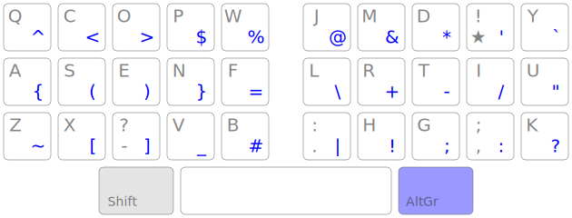

+++
title = "Voyage Ergonomique : Bépolar et philosophie Ergo‑L"
date = 2026-03-08
draft = false
[taxonomies]
tags = ["clavier", "linux"]
[extra]
toc = false
display_published = true 
author = "Cætera"
+++

Les machines à écrire nous hantent encore. Sur le clavier, ça se voit
comme le nez au-dessus du visage.

Les zones rouges, ce sont les zones héritées des machines à écrire :
les touches sont décalées. Les autres touches, ajoutées pour les
ordinateurs, sont disposées en matrices —plus organisées, mais surtout, plus
pratiques.

Mais ce n'est que le début.

Les « touches mortes », vous savez, comme l'accent circonflexe en
Azerty : on tape la touche, il ne se passe rien, puis on tape une autre
touche (comme un `e`), et l'accent apparaît. C'est une mécanique des
machines à écrire —la première touche servait à imprimer l'accent
_sans faire avancer le chariot_, de sorte que la deuxième touche, la
lettre, soit apposée au même endroit. On s'épargnait ainsi une touche
dédiée par lettre accentuée.

Un autre exemple ? Les machines à écrire nécessitaient une grande
alternance des mains pour éviter de bloquer les marteaux en activant
des touches adjacentes. Des dispositions comme [Dvorak] —ou [Bépo], qui
s'en inspire— ont hérité de cette contrainte. Pourtant, activer deux
touches adjacentes, pour peu qu'elles soient bien positionnées, c'est
l'un des enchaînements les plus confortables… _sur un clavier_.

Toutes ces contraintes héritées des machines à écrire font partie
intégrante du mécanisme de base des dispositions « classiques » comme
Azerty, Qwerty, et même Bépo. Mais que se passe-t-il si on change de
paradigme et qu'on imagine une disposition _pensée pour les
ordinateurs_ ? Quelles sont les contraintes pertinentes pour
l'utilisation d'aujourd'hui ?

Ce sont les questions que se sont posées les créateurs d'Ergo‑L, et en
particulier [Nuclear Squid][nuke], initiateur et chef du projet.

La philosophie Ergo‑L
---------------------

[Ergo‑L] est une disposition conçue pour être confortable en français,
en anglais, et pour faire du code. Pour y parvenir, ses créateurs ont
dû trancher : qu'est-ce qui compte vraiment aujourd'hui ?

Leur réponse tient en quelques principes :

- les raccourcis clavier usuels (effectués à une main) sont des
  standards ; il faut conserver leur emplacement autant que possible ;
- les touches les plus accessibles contiennent les lettres _sans
  diacritiques_ ;
- les diacritiques sont produits à l'aide d'une touche unique
  <kbd>★</kbd>, sur laquelle je reviendrai ;
- une couche dédiée à la programmation regroupe les symboles fréquents
  en code, organisés de façon logique ;
- les roulements confortables sont recherchés et privilégiés face à
  l'alternance des mains.

On organise donc la frappe en plusieurs _couches_, chacune ayant une
utilité : lettres, typographie, symboles. C'est l'opposé du paradigme
Bépo, qui cherche à tout mettre en accès direct quitte à positionner
certaines lettres trop loin. À la place, ce sont les touches qui
viennent sous les doigts.

C'est une approche moderne de la dactylographie, où les contraintes
des machines à écrire ne sont plus retenues ; où l'on fait table rase
du passé pour imaginer des solutions simples et élégantes.

Je suis convaincu sur le papier, mais concrètement, comment ça
marche ?

### La couche « alpha » α

C'est le nom qu'on donne aux touches accessibles en direct. Elles sont
uniquement présentes sur les 30 touches les plus accessibles : 5
touches par doigt sur 3 colonnes —les mêmes que celles utilisées par
Azerty et Qwerty pour les lettres. L'avantage : pas de touche comme le <code>É</code>
de Bépo, parfois mal reconnue pour les jeux ou les raccourcis clavier
personnalisés.

### La touche typographique <kbd>★</kbd>

La touche typographique est une _touche magique_.

On n'utilise plus de machine à écrire, donc on s'affranchit de la
contrainte historique : une touche morte, un seul diacritique. La
touche <kbd>★</kbd>, elle, ne se cantonne pas à une seule action. Elle
donne accès à _tous_ les caractères nécessaires à la frappe du
français : accents grave, aigu, circonflexe, tréma, cédille, mais
aussi les ligatures (<code>œ</code> <code>æ</code>), et un certain
nombre de tirets dont les tirets (demi-)cadratins cher à ChatGPT.

Comme le dit un ergonaute : avec la touche <kbd>★</kbd>, on a deux
fois plus de caractères sur la ligne de repos —et ça, c'est
formidable.

C'est cette addition qui permet d'être à la fois efficace en français
et en anglais. Il n'y a plus besoin d'arbitrer entre une lettre avec
accent (qui privilégie le français) et une lettre sans (mécaniquement
plus fréquente en anglais). Les deux coexistent, chacune à sa place.

### La couche <kbd>AltGr</kbd>

Dédiée à la programmation, elle regroupe les symboles fréquents en
code. Hasard fortuit : il y en a 30 —soit le même nombre que les
touches principales.

Les caractères sont organisés de façon logique et cohérente : les
paires sont regroupées (`() {} [] <>`), les opérateurs ensemble, et la
navigation dans Vim est pensée pour être naturelle sans remappage. Tout
cela est bien mieux expliqué dans [l'article de Kazé : Vim pour les
Ergonautes][vim-pour-Ergonautes].

Ergo‑L ? Pas encore.
--------------------

Le problème, à l'époque, c'est qu'Ergo‑L n'est pas stable. La
disposition est en plein développement et connaîtra encore plusieurs
changements importants. Je ne me vois pas apprendre une nouvelle
disposition tous les quatre matins au risque de perdre en productivité
au travail.

En revanche, le groupe derrière Ergo‑L, conscient qu'il n'existe pas
de disposition idéale, développe plusieurs outils :

- [Kalamine] : un générateur de pilote _cross-platform_ ;
- un analyseur (en cours d’intégration à Kalamine, travail initié par votre serviteur), permettant de repérer rapidement les défauts
  d'une disposition ;
- [ducktypist] : un composant web pour apprendre une disposition, réutilisant les fichiers générés par Kalamine.

Il n'en faut pas plus pour me motiver à contacter les développeurs.

Bépolar
-------

L'idée est simple : capitaliser sur mon apprentissage de Bépo pour en
faire une variante suivant les préceptes d'Ergo‑L. Un investissement
faible pour vérifier si la promesse tient —réduire le nombre de
touches pour augmenter le confort— et rendre Bépo enfin compatible avec
l'anglais.

Adapter une disposition, c'est bien plus simple que de partir de zéro.
Mes contraintes étaient claires :

- rester le plus proche possible de Bépo ;
- garder les chiffres en accès direct (par préférence personnelle) ;
- supprimer les touches à diacritique comme `É È` pour _rapprocher_ les touches trop excentrées ;
- positionner les caractères restants de façon à minimiser les enchaînements inconfortables : bigrammes de même doigt, ciseaux,
  etc. ;
- adopter la couche <kbd>AltGr</kbd> développée par Ergo‑L.

Je n'étais pas le seul à avoir cette idée —d'autres avaient commencé,
mais avaient fait des dispositions très personnelles, adaptées à leur
usage. Je voulais quelque chose de plus universel : un outil que
d'autres pourraient utiliser pour tester rapidement si la philosophie
Ergo‑L leur convenait.

Je vous passe les détails de conception, mais cette période fut
passionnante. Bépolar et Ergo‑L ont fini par se nourrir mutuellement.
Je propose par exemple d'inclure le point d'exclamation dans les 30
touches confortables, en reléguant le tréma, peu usité, en double
pression sur <kbd>★</kbd>.

Ce qui me frappe immédiatement : correspondre en anglais n'est plus
une contrainte. C'est un plaisir. La touche <kbd>★</kbd> n'a pas la
_meilleure_ position qui soit, mais elle ne représente que 4 % des
frappes —et surtout, son existence libère d'autres touches, rendant la
frappe bien plus confortable, que ce soit en français ou en anglais.

Venant de Bépo, l'apprentissage est remarquablement rapide. Deux jours
pour retrouver mes repères et ma vitesse. Moins d'une semaine pour
toutes les personnes que je connais qui y sont passées. Ma précision
augmente aussi, ce qui me permet _in fine_ de taper plus vite.

Et pourtant, je ne serai pas parmi les premiers à migrer vers Ergo‑L
à sa sortie. Je resterai encore de longs mois sous Bépolar, redoutant
de devoir tout réapprendre.

Pour les autres utilisateurs de la disposition, c'est un déclic. Je ne
connais personne qui soit revenu en arrière. Certains ont continué vers
Ergo‑L. D'autres sont restés sur Bépolar, satisfaits du compromis
qu'il apportait —confort accru sans réapprentissage.  

Ce qui est unanime, c'est la confirmation que la philosophie Ergo‑L
fonctionne et améliore largement le confort de frappe.

Conclusion
----------
Bépolar m'a appris une chose essentielle : la promesse d'Ergo‑L tient.
Réduire le nombre de touches accessibles en direct, confier les
diacritiques à une touche dédiée, organiser les symboles en couche
logique —tout cela fonctionne. Et le vérifier n'a coûté que deux
jours d'adaptation.

Ce qui est moins évident, c'est ce que Bépolar m'a _aussi_ appris sur
moi : qu'on peut être convaincu par une idée et quand même hésiter à
franchir le pas. Ergo‑L était là, stable, prêt. Et j'ai quand même
attendu. 

Si j’ai fini par franchir le pas, c’est aussi pour intégrer d’autres changements importants —la disposition ne fait pas tout. 

[Bépo]: https://bepo.fr/wiki/Accueil
[Dvorak]: https://fr.wikipedia.org/wiki/Disposition_Dvorak
[Ergo‑L]: https://ergol.org
[Bépolar]: https://github.com/Ced-C/Bepolar
[nuke]: https://piaille.fr/@NuclearSquid
[kalamine]: https://github.com/OneDeadKey/kalamine
[ducktypist]: https://ergol.org/dactylo/
[vim-pour-Ergonautes]:https://ergol.org/articles/vim_pour_les_ergonautes/
