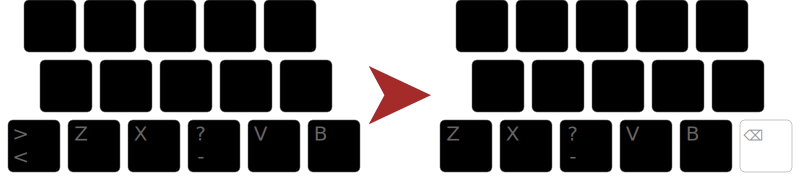

+++
title = "Voyage Ergonomique : À deux touches du bonheur"
date = 2026-03-18
draft = false
[taxonomies]
tags = ["clavier", "linux"]
[extra]
toc = false
display_published = true 
author = "Cætera"
+++

Si les machines à écrire nous hantent encore, j’étais en bonne voie pour devenir exorciste. 
Avec [Bépolar], j’avais validé l’approche d’[Ergo‑L] ; j’étais convaincu que c’était une bonne
solution pour _mon usage_. 
Il n’y avait plus qu’à faire un dernier effort et investir dans l’apprentissage de la 
disposition.

Ergo-L
------
Avec mon expérience d’apprentissage de Qwerty je savais à quoi m’attendre. Ou du moins 
c’est ce que je me figurais ; deux semaines à péniblement apprendre toutes les touches
une par une. Puis, une fois prêt, une baisse de productivité temporaire.

C’est pourquoi, après plus d’un an de Bépolar, début 2024, à la sortie de la _release candidate_
version 1.0 d’Ergo‑L, je me lance dans son apprentissage.
J’utilise ducktypist. Je tiens une semaine, mais je n’avance pas comme les fois précédentes.
Je peine. 
La raison ? Les roulements je pense. En Bépo(lar), les voyelles sont main gauche, et les
consonnes, main droite. Il en résulte qu’on alterne les mains souvent, à chaque sylable. 
En Ergo‑L, les roulements sont privilégiés. Il en résulte que les voyelles sont réparties
sur les deux mains. C’est déroutant. 
Pire, les lettres `EN` qui étaient sur les index au repos, se retrouvent sous les majeurs. 
C’est à la fois similaire et différent. Mon cerveau s’embrouille. 
Les lettres `ENTR` qui sont parmi les plus utiliées et qui s’enchainent dans toutes les 
directions m’embrouille également. Je n’ai pas de repère. 
Je finis par me dire que le moment n’est pas bien choisi, j’abandonne. 

Après tout, même si je savais que la philosophie d’Ergo‑L fonctionnait, je l’avait implémenté
dans Bépolar, et j’en était satisfait. Il a suffi d’une petite baisse de motivation, d’une semaine
un peu plus chargée que prévu au travail pour me faire arrêter. 

La philosophie n’était pas une motivation suffisante. 

En Mai 2024, Ergo‑L sort en version 1.0 et est inclu dans XKB. Ça veut dire que c’est désormais un 
standard sous linux. Bientôt, toutes les distributions proposeront Ergo‑L à l’installation
—et à l’usage. 

Ça voulait dire la certitude de pouvoir utiliser Ergo‑L partout… Y compris sur mes serveurs. 

C’était une motivation forte, et après l’été, je m’y suis remis. 

Je faisais pas mal de [MonkeyType] à l’époque et j’ai donc gardé l’historique de mon apprentissage.
Vous voyez ci-dessous le graph de ma progression en Ergo‑L. J’ai commencé MonkeyType après avoir « fini »
duckTypist, l’outil développé par Ergo‑L pour apprendre la dispo. 

{{plotly(id="fig", file="fig.json")}} 

Les roulements, c’est difficile à appréhender au début parcequ’on tape les touches une par une,
le temps que la disposition rentre dans les doigts. 
Ensuite, ça devient grisant. On à l’impression de faire des vagues sur son clavier, de suivre un 
rythme régulier mais pas uniforme. C’est très satisfaisant. 
Au bout d’un mois, je suis à ~60 mpm, c’est largement suffisant pour travailler. Puis, ça continue à monter.

Je suis content d’avoir fait le grand saut. En y réfléchissant, ce n’est que parce qu’Ergo‑L est intégré dans
XKB que je l’ai fait. J’hésitais à y proposer Bépolar ; cette expérience me fait penser que ce n’est pas une
bonne idée —je décide de ne pas le faire.

Variante A ou _Angle‑Mod_
-----------------------
Le truc que je n’ai pas précisé, c’est que quitte à perdre mes habitudes et à changer de dispo,
je me suis dit que j’allais essayer une méthode qui tourne pas mal sur la communauté des clavier.
La variante A. 

L’idée est simple, mais pas facile à expliquer. En dactylographie, chaque touche est associée à un doigt. 

{{ img(id="ergol_ansi.svg", alt="Un clavier ANSI", caption="Un clavier ANSI, les différences avec le clavier ISO sont entouré en rouge.")}}
{{ img(id="ergol_iso.svg", alt="Un clavier ISO", caption="Un clavier ISO, les différences avec un clavier ANSI sont entouré en rouge.")}}

Sur un clavier décalé, les claviers « classiques », le décalage des touches induit un mouvement
des doigts inconfortable :  on a les doigts qui bougent en `\\`.
Ce n’est pas symétrique, et ça casse un peu les poignets. Il en résulte que la main droite suit 
un mouvement bien plus naturel et confortable. 
Une punition de plus pour les mains gauches mal aimées. 

L’idée de la variante A, c’est d’utiliser la touche supplémentaire sur les claviers européen,
les fameux claviers ISO, pour corriger cette posture.

Mais pour ce faire sans dégrader la disposition, il faut décaler les symboles égalements. 

On passe alors d’un mouvement en `\\` à un mouvment en `/\`, certains y voient un `A`
—c’est _l’angle-mod_.

Avec cette variante, la position de frappe se rapproche de celle d’un clavier ergonomique.
C’est un gain énorme en confort, et ça rend l’utilisation d’un clavier ISO acceptable. 

C’est le détail qui permet de profiter du clavier de sont ordinateur portable.
Plus besoin de se déplacer avec un clavier ergonomique. 

Cerise sur le gateau, la touche _la moins confortable_, la touche <kbd>B</kbd>
n’est plus utilisée pour les lettres. 
Étant équidisante des index (et pouvant donc être utilisé des deux mains),
certains y voient un emplacement parfait pour rapprocher la touche _backspace_. 

J’ai une meilleur approche —avec une autre touche magique. 

L’autre touche magique <kbd>⎄</kbd> 
------------------------------------
La force d’Ergo‑L, c’est de considérer qu’il y a peu de touche agréables à utiliser.
Dès lors, on se focalise sur les symboles dont tout le monde à besoin pour frapper :
les lettres, la ponctuation, et les diacritiques nécéssaire au français. 

C’est la seule façon d’être universaliste et de correspondre au besoin du plus grand
nombre. C’est donc une disposition qui n’apporte que le nécessaire, et ferme la
porte à toute les possibilités apportées par Unicode. Enfin pas tout à fait. 
Pas sous Linux en tout cas qui possède encore une touche particulière. 
Une touche qui, brille autant par son utilité que son manque d’emplacement physique
sur le clavier —la touche compose (<kbd>⎄</kbd>).

Cette touche, elle permet de frapper un symbole en en mélangeant d’autres. 

Par exemple, <kbd>⎄</kbd>-`->` donne `→`, ou encore <kbd>⎄</kbd>-`tm` donne `™`.
Les séquences disponible de base dépendent de vos paramètres régionaux (ou _locale_).
Vous trouverez [ici les séquences composes](https://cgit.freedesktop.org/xorg/lib/libX11/plain/nls/en_US.UTF-8/Compose.pre)
les plus courantes disponible pour la _locale_ en_EN, dont une bonne partie sont reprises en français. 

Mais le plus intéressant, c’est qu’on peut ajouter nos propres séquences personnalisées. 
Pour ça il suffit des les ajouter au fichier `~/.XCompose` pour les adapter à vos besoins.

L’avantage de cette méthode c’est que les séquences sont bien plus simple à mémoriser 
qu’une touche arbitrairement définie sur un clavier. 

On peut y mettre ses émojis préférés, ou des symboles utiles à votre usage. 

Parlant d’Ergo‑L et de la touche typo (<kbd>★</kbd>), nommée _one dead key_ 
en anglais, j’ai naturellement une sécance <kbd>⎄</kbd>-`odk` → `★`

> **NB :** Ne pas oublier de recharger sa méthode de saisie (ex. sous Gnome `ibus restart`) **ou** de se relogger pour que les changements soient appliqués
> 
> **Pro-tip :** On peut, pour se simplifier la vie, en ajoutant des préfixes pour les séquences de mêmes types. Par exemple, dans mon fichier compose, tous les émojis commencent par le symbole `:`. Cela permet d’éviter les collisions avec d’autres symboles tout en étant plus simple à mémoriser.
> 

On peut même aller plus loin et utiliser un système simple de _snipets_ grâce à la touche. Par exemple, <kbd>⎄</kbd>-`rdv`, peut donner `rendez-vous`. Ça peut servir à écrire plus facilement son adresse courriel, son numéro de téléphone, ou d’autre informations pas trop sensibles quand même —le fichier est en claire. 

À deux touches du bonheur
-------------------------
Avec Ergo‑L (version ISO _a.k.a angle-mod_), l'angle-mod, la touche <kbd>★</kbd> et la touche <kbd>⎄</kbd> idéalement positionnée, j'ai une disposition me permettant de taper en français, en anglais, d'avoir les symboles de programmation sous les doigts, et tout ce qu'Unicode peut offrir à la volée. Surtout, ça s'appuie sur des standards : Ergo‑L désormais intégré à Linux, Compose présent depuis longtemps dans les systèmes Unix.

{{ img(id="ergol_am_compose.svg", alt="Un clavier Ergo‑L avec l’angle-mod et la touche compose", caption="Un clavier Ergo‑L avec l’angle-mod et la touche compose")}}

Mais c'est l'_angle-mod_ qui m'a appris la chose la plus importante. Je suis rentré dans le monde de l’ergonomie par la disposition, mais c’est probablement ce qu’il y a de moins important. La géométrie du clavier lui-même, la posture, l’environnement sont autant de choses qui font l’ergonomie. Ma vision s’est rapprochée de celle de Kazé et tient en 3 mots : confort sans blessures. 

Taper en Ergo‑L, même parfaitement configuré, dans une position trolesque dans son lit… n’est pas ergonomique.

[MonkeyType]: https://monkeytype.com
[Bépolar]: https://github.com/Ced-C/Bepolar
[Ergo‑L]: https://ergol.org/
