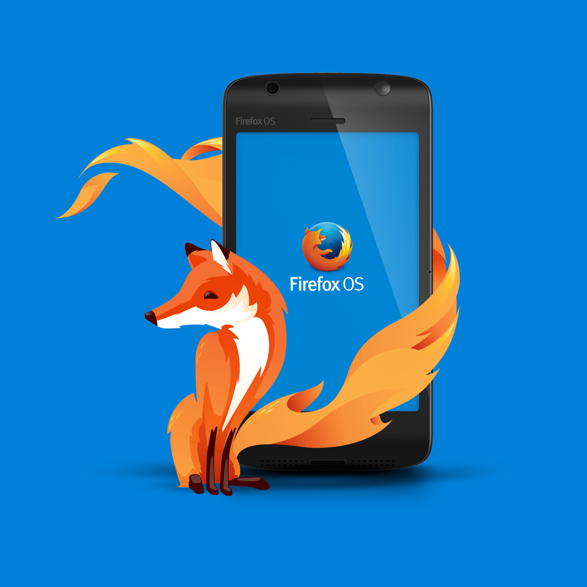
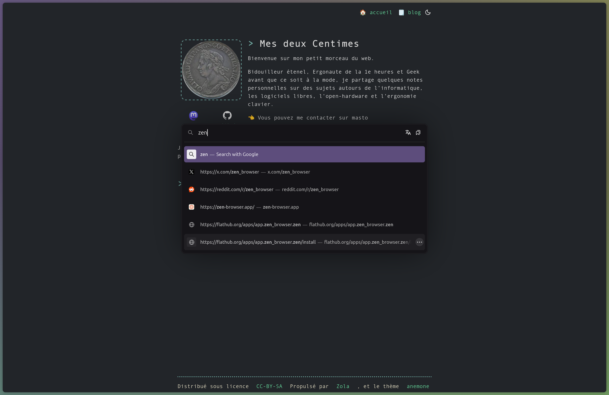

+++
title = "Zen Browser : Ce que Firefox aurait dû devenir"
date = 2025-08-15
draft = false
[taxonomies]
tags = ["libre", "firefox", "software"]
[extra]
toc = false
display_published = true 
author = "Cætera"
comment_id = "115140151602016449"
+++

La lente décente de Firefox
---
Je n’avais pas changé de navigateur depuis plus de vingt ans.
Vingt ans à soutenir Mozilla et [Firefox][firefox].
J’avais même acheté un téléphone sous FirefoxOS à l’époque : le Flame, c’est dire !

Pour moi, Firefox c’était une évidence, c’était David contre Goliath,
c’était le seul navigateur indépendant et complet, avec un écosystème riche de _plugins_ offrant des possibilités de personnalisation quasi infinies.

C’était aussi _historiquement_ un avocat d’un web plus juste, plus neutre, plus soucieux de notre vie privée. Mais ça, c’était au début des années 2000. Depuis les années 2010, les choses se sont petit à petit dégradées.

D’abord lentement : Firefox est passé du rôle de _leader_, démocratisant de nouveaux usages —onglets, marque-pages, plugins— à celui de _suiveur_, adoptant avec retard les innovations que proposait Google avec Chrome.  

Firefox est devenu plus lent, moins attrayant, mais il gardait au moins une force : la protection de notre vie privée. J’y croyais tellement que j’avais même acheté un téléphone sous FirefoxOS, convaincu qu’il fallait soutenir cette alternative face aux GAFAM.

Mais il faut bien l’admettre : depuis 10 ans, Mozilla enchaîne les mauvaises décisions. Et si les parts de marché ne cessaient de baisser, je restais fidèle… faute d’alternative crédible.

Les forks de Firefox
---
Je pensais ne jamais trouver un navigateur qui respecte mes critères (par ordre d’importance) :
- **Pas** basé sur Blink (et basé sur Gecko/Servo si possible)
- Stable
- Respectueux de la vie privée
- Capable de gérer un grand nombre d’onglets
- Compatible avec les extensions

Et pourtant, des alternatives existent :
- [Waterfox](https://www.waterfox.net/), l’historique
- [LibreWolf](https://librewolf.net/), radicalement tourné vers la vie privée
- [Floorp](https://floorp.app/en-US), très orienté personnalisation

Et ma dernière découverte : celui qui m’a fait basculer : **[Zen Browser](https://zen-browser.app/)**.

Zen Browser
---
Zen Browser, c’est ce que Firefox aurait dû devenir : respectueux de la vie privée, performant **et** innovant.

### Une interface moderne et cohérente
Zen repense l’expérience utilisateur.
Son interface, inspirée d’Arc Browser, introduit des onglets verticaux par défaut, élégants et ergonomiques. Trois types d’onglets sont proposés :
- **Normaux**
- **Épinglés** (fermables mais persistants)
- **Essentiels** (toujours visibles, toujours chargés)

Un mode compact permet de masquer la barre latérale jusqu’au survol, libérant l’écran et donnant un aspect ultra minimaliste, permettant de se focaliser sur la page en cours —une navigation plus… zen ?

Avec Zen, chaque choix de design est cohérent : onglets verticaux adaptés aux écrans larges, adresse minimaliste, absence de page de nouvel onglet —remplacée par un champ de recherche flottant façon _command pallet_ dans les app modernes VScode, Obsidian pour en citer quelques une avec ce principe.

### Des fonctionnalités qui comptent
Zen ne se contente pas de changer l’apparence. Il ajoute des fonctionnalités qui semblent naturelles :
- **Split View** : affichage jusqu’à 4 pages côte à côte, intégré au navigateur.
- **Spaces** : de véritables espaces de travail séparés (cookies, sessions, onglets essentiels propres à chaque espace), avec intégration aux *containers* de Firefox.
- des détails bien pensés : on a par exemple contrôler youtube via une barre dédiée qui apparait seulement quand on a une vidéo en cours. 

Ces outils transforment la navigation sans la compliquer. Là où Mozilla tergiverse avec des gadgets d’IA peu aboutis, Zen propose des solutions simples et efficaces.  

### Personnalisation et extensions
Zen hérite du meilleur de Firefox : compatibilité totale avec ses extensions, synchronisation via un compte Firefox, DRM, mode image dans l’image, traductions locales, etc.  

Mais il va plus loin :
- Paramètres de confidentialité plus stricts par défaut (télémétrie désactivée, appels externes limités).
- Un système de thèmes colorés et dynamiques qui donnent une identité visuelle unique au navigateur.

Zen reste compatible avec les comptes firefox et, comme il n’est pas disponible sur mobile, cela permet de synchroniser sa navigation et ses mots de passes avec firefox sur Android ou iOS, c’est appréciable.

### Installation
Zen n’est pas encore disponible dans les dépôts classiques. On a donc trois possibilités d’installation :
- Téléchargé le binaire et l’exécuter en _userspace_ ; il est ensuite capable de se mettre à jour tout seul
- Télécharger l’AppImage depuis le [GitHub officiel](https://github.com/zen-browser/desktop)
- Télécharger Zen via [Flathub](https://flathub.org/).  

Le projet est encore en bêta, mais déjà très stable dans mon usage quotidien, rapide, fluide, et sans compromis ; je l’utilise à la maison comme au travail sans souci notable !

Conclusion : un vrai souffle d’air frais
---
Zen c’est « juste un nièm fork » de Firefox, mais très bien réalisé. C’est une réinterprétation moderne, élégante et pragmatique de ce que devrait être un navigateur en 2025.
Un navigateur centré sur l’utilisateur qui ne cède pas aux modes du moment, et ça, ça fait du bien.

Pour moi, Zen est ce que Firefox aurait dû devenir.

[firefox]: https://www.mozilla.org/firefox

